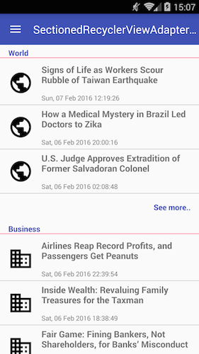
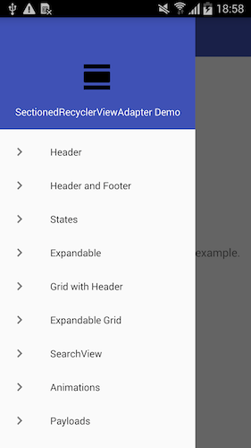

:warning: **Archived**: this repository is no longer going to be maintained.

# SectionedRecyclerViewAdapter

An Adapter that allows a RecyclerView to be split into Sections with headers and/or footers.

[](https://jitpack.io/#luizgrp/SectionedRecyclerViewAdapter)
[](https://travis-ci.org/luizgrp/SectionedRecyclerViewAdapter)
[](https://codecov.io/gh/luizgrp/SectionedRecyclerViewAdapter)
[](https://android-arsenal.com/details/1/3471)




In addition, each Section can have its state(Loading/Loaded/Failed/Empty) controlled individually.


---

## Gradle Dependency

##### Step 1: Add jitpack repository to the [top-level](https://developer.android.com/studio/build#top-level) build.gradle file: 
```groovy
allprojects {
	repositories {
		...
		maven { url 'https://jitpack.io' }
	}
}
```

##### Step 2: Add this library to the [module-level](https://developer.android.com/studio/build#module-level) build.gradle file:

```groovy
dependencies {
	...
	implementation 'com.github.luizgrp:SectionedRecyclerViewAdapter:v3.2.0'
}
```

Guide to upgrade to version 3.x [here](https://github.com/luizgrp/SectionedRecyclerViewAdapter/wiki/Upgrading-to-3.x).

Latest version without AndroidX: `1.2.0`.

## Basic usage

##### 1) Create a custom Section class:

```java
class MySection extends Section {
    List<String> itemList = Arrays.asList("Item1", "Item2", "Item3");

    public MySection() {
        // call constructor with layout resources for this Section header and items
        super(SectionParameters.builder()
                .itemResourceId(R.layout.section_item)
                .headerResourceId(R.layout.section_header)
                .build());
    }

    @Override
    public int getContentItemsTotal() {
        return itemList.size(); // number of items of this section
    }

    @Override
    public RecyclerView.ViewHolder getItemViewHolder(View view) {
        // return a custom instance of ViewHolder for the items of this section
        return new MyItemViewHolder(view);
    }

    @Override
    public void onBindItemViewHolder(RecyclerView.ViewHolder holder, int position) {
        MyItemViewHolder itemHolder = (MyItemViewHolder) holder;

        // bind your view here
        itemHolder.tvItem.setText(itemList.get(position));
    }
    
    @Override
    public RecyclerView.ViewHolder getHeaderViewHolder(View view) {
        // return an empty instance of ViewHolder for the headers of this section
        return new EmptyViewHolder(view);
    }
}
```

##### 2) Create a custom ViewHolder for the section items:

```java
class MyItemViewHolder extends RecyclerView.ViewHolder {
    private final TextView tvItem;

    public MyItemViewHolder(View itemView) {
        super(itemView);

        tvItem = (TextView) itemView.findViewById(R.id.tvItem);
    }
}
```

##### 3) Set up your RecyclerView with the SectionedRecyclerViewAdapter:

```java
// Create an instance of SectionedRecyclerViewAdapter
SectionedRecyclerViewAdapter sectionAdapter = new SectionedRecyclerViewAdapter();

// Add your Sections
sectionAdapter.addSection(new MySection());

// Set up your RecyclerView with the SectionedRecyclerViewAdapter
RecyclerView recyclerView = (RecyclerView) findViewById(R.id.recyclerview);
recyclerView.setLayoutManager(new LinearLayoutManager(getContext()));
recyclerView.setAdapter(sectionAdapter);
```

## Demo app

You can find a demo app [here](app) with many examples on how to implement:

- [Section with Header](app/src/main/java/io/github/luizgrp/sectionedrecyclerviewadapter/demo/example1/)
- [Section with Header and Footer](app/src/main/java/io/github/luizgrp/sectionedrecyclerviewadapter/demo/example2/)
- [Section with States](app/src/main/java/io/github/luizgrp/sectionedrecyclerviewadapter/demo/example3/)
- [Expandable Section](app/src/main/java/io/github/luizgrp/sectionedrecyclerviewadapter/demo/example4/)
- [Grid Section with Header](app/src/main/java/io/github/luizgrp/sectionedrecyclerviewadapter/demo/example5/)
- [Expandable Grid Section](app/src/main/java/io/github/luizgrp/sectionedrecyclerviewadapter/demo/example6/)
- [SearchView with Sections](app/src/main/java/io/github/luizgrp/sectionedrecyclerviewadapter/demo/example7/)
- [Animations](app/src/main/java/io/github/luizgrp/sectionedrecyclerviewadapter/demo/example8/)
- [Payloads](app/src/main/java/io/github/luizgrp/sectionedrecyclerviewadapter/demo/example9/)



## Apps on Google Play using this library

- [JStock](https://play.google.com/store/apps/details?id=org.yccheok.jstock.gui)
- [WeNote](https://play.google.com/store/apps/details?id=com.yocto.wenote)

## License

    The MIT License (MIT)

    Copyright (c) 2016 Gustavo Pagani

    Permission is hereby granted, free of charge, to any person obtaining a copy
    of this software and associated documentation files (the "Software"), to deal
    in the Software without restriction, including without limitation the rights
    to use, copy, modify, merge, publish, distribute, sublicense, and/or sell
    copies of the Software, and to permit persons to whom the Software is
    furnished to do so, subject to the following conditions:

    The above copyright notice and this permission notice shall be included in all
    copies or substantial portions of the Software.

    THE SOFTWARE IS PROVIDED "AS IS", WITHOUT WARRANTY OF ANY KIND, EXPRESS OR
    IMPLIED, INCLUDING BUT NOT LIMITED TO THE WARRANTIES OF MERCHANTABILITY,
    FITNESS FOR A PARTICULAR PURPOSE AND NONINFRINGEMENT. IN NO EVENT SHALL THE
    AUTHORS OR COPYRIGHT HOLDERS BE LIABLE FOR ANY CLAIM, DAMAGES OR OTHER
    LIABILITY, WHETHER IN AN ACTION OF CONTRACT, TORT OR OTHERWISE, ARISING FROM,
    OUT OF OR IN CONNECTION WITH THE SOFTWARE OR THE USE OR OTHER DEALINGS IN THE
    SOFTWARE.
